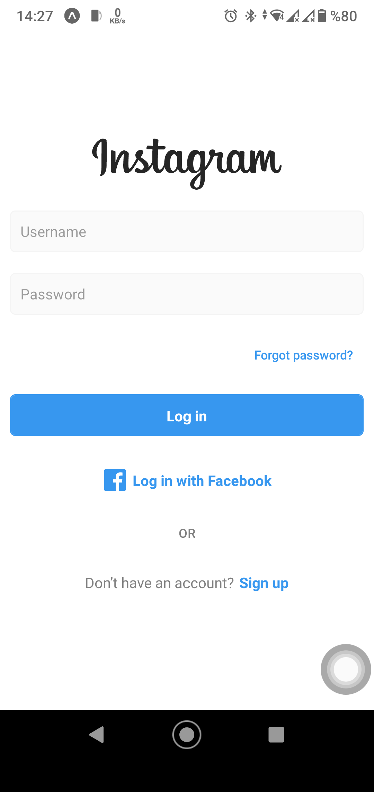
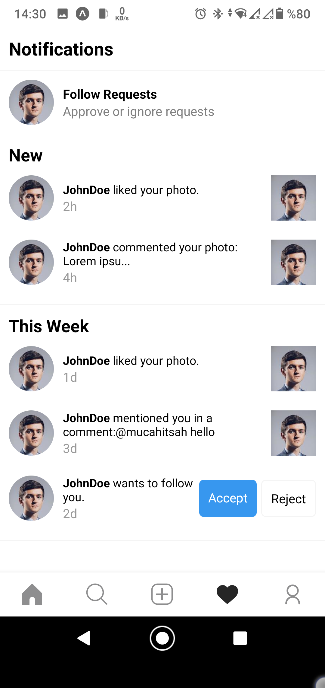
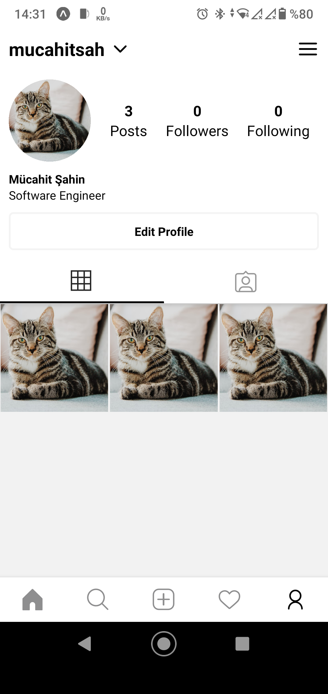

# Instagram Mobile App

In this project, I tried to realise the instagram mobile application with react native. The project is still ongoing.

## Used Technologies

- react-native
- expo
- redux-toolkit
- react-navigation

## Screens

- Login
- Home
- Explore
- Notifications
- Profile
- Posts
- Post Details
- Story
- New Post

## Images

